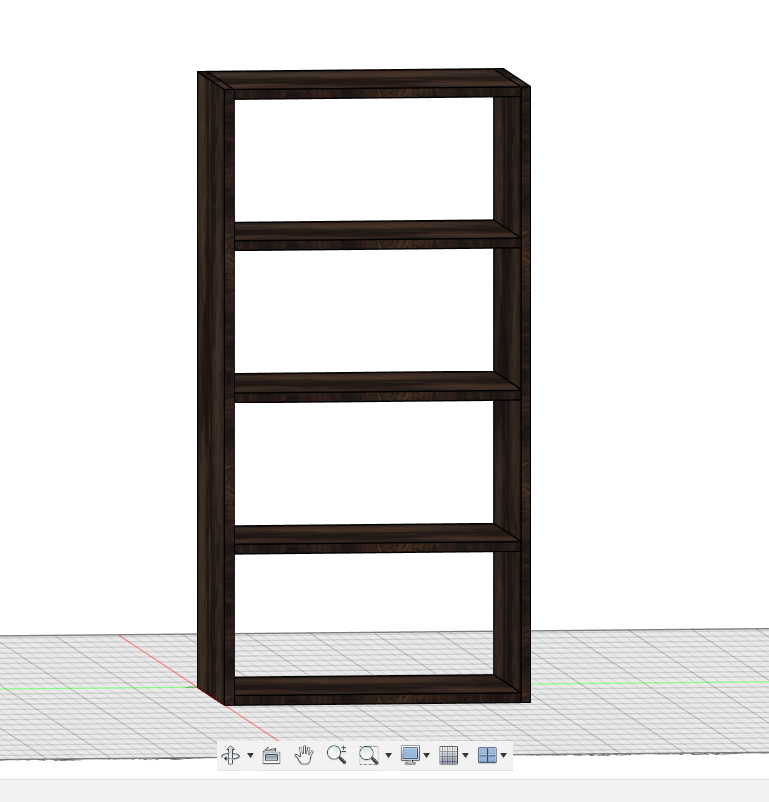
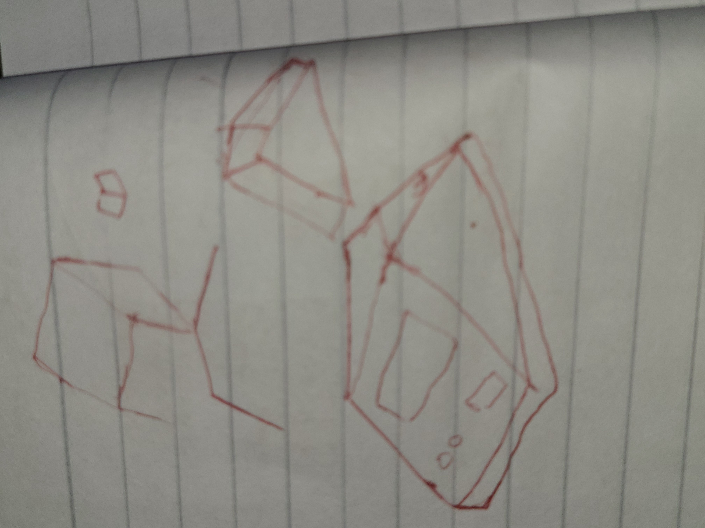
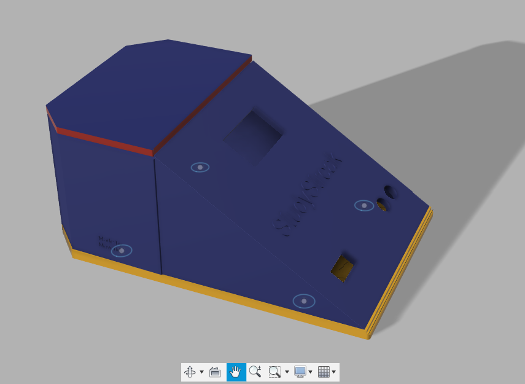

## May 31

It is my first hardware project. I have been thinking of trying out onboard since I joined hackclub, but I never got a chance.
I think this highway is my best shot. I am currently planning and synthesizing stuff. I wanted something original that's why I didn't start with the starter project.
I am currently vetting my plans. I have a solid idea already thanks to my buddy that knows a lot about hardware :)
I will be frank I have an AI partner that helps me in brainstorming. My journal is original, and this is just the beginning. 

[No Image today ;0]

spent 2hrs

## June 01

I am done with my plans, but I still gotta research parts that are needed. 
I was confused at first thinking we need to make the full project before submitting. I have to check the highway guidelines once more
and I think I just have to design and make BOM. I set up the MicroPico extension on VS Code and switched stubs to ESP32. 
I will be using Python instead of C++ for now. I will switch when I am more comfortable with my shitty skills in C++. I suck at it.
I faced some errors initially and I found out it's fine since the hardware ain't connected. 

I started coding some firmware offline for now. I made pomodoro logic and idk if it's gonna work that well but I made it just in case.

A sneak peek hehe
I will check if my plan needs change but for now see ya tomorrow

spent 3hrs

## June 02

I started today with a block diagram of how I will connect my stuff. I started sketching in my journal
I then remembered excalidraw and I immediately discarded my journal to use it. I did some research initially, 
and thanks to AI for clarifying things. I spent an hour and a half making the block diagram. I ensured it's readable
I spent an extra 10 mins taking out useless aesthetics I added like colors. 

I love this block diagram. it is pretty ngl. it wasn't easy stopping at this hehe
After that I tested my shitty code and as expected it was a bit buggy. I ran some tests and confirmed some issues with my logic and I made some fixes.
I spent 2 hrs debugging as I added like 20 print statements just to get the exact error location. I did spend extra time cleaning the 
print statements. I ran the last test and yay it's working from Python's end :|
Now I made the main orchestrator which is the main_controller.py
it was easier to implement as mostly it is placeholders and part of pomodoro logic. 
I am working in parallel cuz I just made my BOM template on google doc. I covered some parts as it was just rough hehe

spent 5hr 20mins

## June 03

I did a lot of coding today as I spent time making some of the firmware. I made a handler for TCRT5000 Sensor Module though no hardware integration yet. I spent some time researching how to work with the sensor to detect presence. I made a generic presence class.
I improved pomodoro logic and just added short break to the class. I made handlers for the WS2812B RGB LED, SSD1306 OLED Display Module, and TTP223 Capacitive Touch Sensor Module just like tcrt5000 - no hardware connection just a class ready to work with them. I had to do a little bit of research just to make sure things work. it didn't work straight away lol. I faced some bugs that are stupidly easy but hard to find. I ran several tests and some still failed so I am stopping here for today. I put them together in the main controller, and I added lots of print statements just for debugging. 

I am also gathering datasheets for my components to understand some stuff about them. I think this is where everything will get hot. I gotta read them still. Not all but part of it. I will journal anything I find interesting here.

spent 4hr 12mins

## June 04

I went through the datasheets, and I was hit by technical details I know nothing about. I spent time on YouTube and other tools that could help me understand those sheets. It was frustrating because I don't even know where to start at first, so I started anyway exploring the diagrams first. Without yapping too much lemme jot some key stuff I found useful to my project.

#### ESP32-DevKitC V4 (with ESP32-WROOM-32)

It will be the power source for most of the components. Some utilize 3.3V output (for OLED, TCRT5000, TTP223) and some 5V output (from USB, for WS2812B). The logic level is 3.3V. I figured out the tentative pin assignments for StudyStreak, here they are;
- OLED SDA - GPIO21
- OLED SCL - GPIO22
- WS2812B Data - GPIO4 (Idk just the one I like)
- TCRT5000 Analog Out - GPIO34 (ADC1-CH6, input-only)
- TTP223 Output - GPIO13 (not concluded)
I found out I gotta avoid some pins as they are used for flash memory like GPIOs 6, 7, 8, 9, 10, 11 etc
Some buttons I saw in the sheet are EN(Reset), Boot (Download mode)

The diagram is colorful and cool

#### 0.96" I2C OLED Display

The module has a SSD1306 Controller with 128x64 pixels (my mobile is 3200x1440 😭😭) anyway I'm not making a phone. It uses I2C Interface which is suitable and as provided above I will be sticking to 3.3V for operating voltage (it supports up to 5V). For the pinout I'll do
- VCC (connect to ESP32 3.3V)
- GND (connect to ESP32 GND)
- SCL (connect to ESP32 I2C SCL pin like GPIO22)
- SDA (connect to ESP32 I2C SDA pin like GPIO21)
I want to use 0x3C for the I2C Address since it's 7-bit address though some libraries, according to a certain source, might refer to 0x78 if they mean the 8-bit address idk I still didn't get it.

The diagram here is kinda b&W

#### TTP223 Capacitive Touch Sensor Module

My fav module. It was the easiest to grasp since it's a touch sensor and it makes sense. The operating voltage ranges from 2.0V to 5.5V, but I'll use 3.3V to stay on a safe point. For the pinout we'll do 3 lol
- VCC (connect to ESP32 3.3V)
- GND (connect to ESP32 GND)
- OUT (signal - connect to a digital GPIO on ESP32 like GPIO13)
I am still trying to understand the output behavior but it seems I will go with the common one. Active HIGH means OUT pin goes HIGH when touched, LOW otherwise. Momentary means OUT pin is HIGH only while touched. Here is the schematic diagram 

ughh my neck hurts damn

#### WS2812B Addressable RGB LED

uhm this doesn't support 3.3V operating voltage at all so we are using 5V instead though it ranges 3.5V to 5.3V. It works with data input logic level which requires VIH of at least 0.7*VDD. if VDD=5V, VIH_min = 3.5V. We'll use the following pinout
- VDD (power - connect to ESP32 5V)
- VSS (ground - connect to ESP32 GND)
- DIN (data input - connect to ESP32 GPIO like GPIO4)
- DOUT (data output - not used for a single LED)
I will use a single data line for control which is a specific timing protocol (handled by neopixel library). The data format is 24 bits per LED, GRB color order.

#### TCRT5000 Reflective Optical Sensor

This is also my fav module. It senses reflected IR or Infrared light as a means to detect something. The likely pinout I will consider:
- VCC (connect to ESP32 3.3V)
- GND (connect to ESP32 GND)
- AO (Analog Output - connect to an ESP32 ADC pin like GPIO34)
- DO (Digital Output - will be optional, may not use if AO is available and preferred)
The operating voltage I'll use is 3.3V even though it ranges from 3.3V to 5V. The output behavior esp AO which I assume is common pull-up config on module. So, the voltage decreases with increased reflection or presence of an object. If no object = AO voltage is HIGH, near VCC. If object present = AO voltage is LOW. Though the sensitivity and specific voltage range will kinda need calibration with the actual hardware

phew a marathon today.

spent 7hrs (estimated)

## June 05

Uhmmm I gotta sleep guys 

I updated my BOM after going through all the datasheets. I got some price ranges and I found out the best place to get everything is Aliexpress. Amazon is too expensive and local sellers are too expensive. They also don't accept HCB; hence, I gotta stick to aliexpress. I didn't do much today. 

spent 1hr 23 mins

## June 07

Yesterday was a special holiday so I took the day off. I started today by exploring PCB schematics. Make no mistake I am new to this but I can get stuff really fast. I will be using EasyEDA for now. I explored it (more of playing around with it). I went on YouTube to check for videos on basics, but I ended up scrolling through reels until I forgot what brought me there and left. I went to get groceries then my chaotic mind remembered I was supposed to learn PCB basics on YouTube. Damn!!
I made some firmware updates which I find easier than going to YouTube to learn PCB. I'll give it a shot tomorrow, hopefully

spent 2hr 52 mins

## June 08

I started using Easy EDA. It has this weird interface (not as weird as adobe illustrator). I know nothing about it, and I was supposed to check tutorials. I wasn't wired to start with tutorial tbh. I just have to break something to get a tutorial. I messed around with the drawing tools and the wire tools. For some reason some of these tool drawings disappear when changed. It feels like figma and illustrator.

well enough with that. I started going through the documentation and it was boring enough I slept there. kidding didn't sleep just skipped. I searched some videos on YouTube and saved them for later. I promise to make my schematic today

spent 1hr 12 mins

## June 09 

I promised myself yesterday that I will be making my schematics today. I set off by going through a 41 mins video on using easy eda. I watched up to 23 mins and stopped (yup I barely finish a YouTube video). I felt an itch to start something instead of just watching. I now understood tools and how to search for components. I went back to my jottings from my datasheet and I went back to my datasheet. I did that because my jotting wasn't that useful. I started with the ESP32-DEVKITC which is the brain and connects to everything. I then got the remaining 4 components. I wasn't able to get the module for TTP223 and TCRT5000. I used a generic 3-pin header and changed their label to my corresponding components adhering to the datasheet.
Oh it wasn't smooth. I hit a roadblock when finding the "right" module. I had to look closely at the datasheets and the web. I was going mad when I couldn't find the modules for TTP223 and TCRT5000. A web result I found mentioned I could use generic headers and stuff, lucky me. Anyways after everything, I made my first schematics and I am more than happy tbh

here take a look. it looks amazing to me.

spent 6hrs 2mins

## June 10

I continued working on my schematics making some fixes and additions of resistors and capacitors.
I added a resistor of 330 ohms in between WS2812B DI and ESP32 IO4 to protect it from any unexpected voltage spikes from the ESP32. I learned this tip on reddit. I had no idea or plans to add them there. I added a capacitor to WS2812B LED to smooth any current spikes the LED will demand. I added 100uF. I found out the LED turns on and switches to a bright light, it draws a sudden spike in current which might make the ESP32 reset. A friend (friend of a friend lol) told me to add I2C pull-up resistors (OLED). I had to research it and finally added two resistors between SCL and 3.3V (with VCC) and same with SDA. 
I did an ERC and a lot of pins were not connected though I found out it was fine. 
here is the screenshot

see you tmr

spent 2hrs 3mins

## June 11

I started drafting or lemme say I was sketching. I sketched what I believe will be the case of my project. I started with research on how OLEDs are normally placed on a case and I found the angled one more sleek and stylish. So I took inspiration from them. I used excalidraw to sketch. At first, I didn't know what I was doing and I was making things that were strange. I couldn't use the pen tool. I had to check YouTube for tips and tricks to use excalidraw. It was powerful based on what I saw about it. I used it before but just basic stuff. I saw a video on how to manipulate lines, and this is when everything clicked (no breakthrough yet). I drew some lines and curved them with no real destination. I had to go to gemini and ask for help in brainstorming something original. It asked me to answer a few questions about how I imagine it to be. I should view it as if it was on my desk. I imagined a mouse tbh. I told it what I imagined so It said make it original. I feel it should look like a mouse though smaller. 

this was my first sketch (not kidding) I was obsessed so I tried to make it better. I made something a bit worse but it gave me an idea. Add and subtract -
it is a figma thing. I wasn't good at figma, but at least I am not that bad at its concept. I started experimenting with shapes. Excalidraw lacks the tools and lots of shapes. it was limited. 

I remembered the library tool. I used it to get more shapes to use. I saw semi-circles, curved lines and other shapes and that is where I made breakthrough. I channeled my shitty figma skills, and it was rewarding hehe. enough of this yapping lemme share it.

here is everything together. Lemme share the views too.

Here it is. It is not perfect and I don't expect it to be. ty

light mode

spent 4hrs 

## June 12

I will confess:
I forgot to make GND connections 😭😭. I thought I was done. I started working on the PCB. 
Man I was confused ngl. The PCB outline was initially small. my 70mm by 50mm was wrong. I chose rounded rectangle which successfully gave me headaches. I then changed to rectangle by remaking the PCB. So it was a mess I was putting them in the outline but those connections made me think I was doing things wrong. I remembered I have a deadline so I'll check YouTube tomorrow to confirm if I am doing things right.

hehe, I made this.

spent 2hrs

## June 13

I finally found a YouTube video on how to do it. I quietly followed it step by step. I referred to my sketch to make sure I am putting things right.
The issue is my resistor is big like too big. See my day 13. I know resistors are small but wtf is wrong with mine. I made a small google search about it. I saw that it was related to footprint and I found out through a thread that using R0805 is more than enough. I then went to change it but that part was not editable like I was confused. I was learning a lot of info simultaneously eh?
I then played around for some minutes then I went back to my schematic design and checked it again. aha! It was editable and I searched for R0805 and finally saw it. I did it for my 3 resistors. It was so satisfying when I updated my PCB and found out it worked. Now we have issue with the outline again. LUCKY for me I can make custom outline since the one I have is too big. I then drew stuff like diagonal around it. too much winning today ahahaha 

hey did I tell you how satisfying was it to see the 3d version? it feels good more than milkshakes (strawberry always the GOAT)
I will starve y'all the image of the 3d one until I am done with routing tomorrow.

spent 2hrs

## June 14 

Cousin birthday 

## June 15

I took yesterday off, it was my cousin's birthday. I started with routing today. it was the first thing I thought of. I well used the auto route. I don't have much time to waste anymore. I clicked auto route and voila it made it perfectly. I then moved to copper pour. I set my Nets to GND and then made the outline for copper pour both for the top layer and bottom layer. I clicked rebuild and boom!! it worked
Nein!!!!!!!!!!!!!! don't be silly, it didn't work and it wasn't straightforward. In fact I fundamentally messed up. I was losing brain cells for nothing. it was GND like it wasn't connected to the Netflag GND. phew, I did it 
my copper pour now rebuilds and worked. remember it has to be always the schematics hehehe
I repositioned labels and any generic stuff not to obstruct the copper lines. I added labels for generic 3-point components I used for TCRT5000 and TTP223 so I did that to avoid confusion when putting things together. things have been straightforward so far.
I did add my labels and I will share screenshot now

it was sooooooooooooo satisfying and my obsession is maxed. 
Oh lemme share the 3d. I bet you will love the view lmao

here is the back for no reason

so I will be moving straight to CAD tomorrow. see ya

spent 4hrs approximately

## June 16, 17, 18, 19, 20, 21, 22, 23

I was away, I couldn't work on the project given a school project and test we were doing. I had to take time off for the sake of mental health. I am juggling a lot of stuff and I had to drop some and focus on urgent and very important tasks. I did learn a bit about CAD. I want to bring my sketch to life. I downloaded fusion 360 for students. I got the license through my brother's college email lol.
I downloaded and installed it. I followed each instruction and I was good to go. I mean I got other things to beep beep......

## June 24

Phew things have eased out but not over though gotta finish my 3d model by June 30. I started the day by searching for tutorials on YouTube like any other noob-to-be nerd. I found a couple of videos on YouTube and tbh I saw ones encouraging and discouraging learning CAD with fusion 360. Uhm, I was kinda confused rn............kidding I wasn't as I already know what I want. I just looked for most recent and most watched video on fusion 360 tutorial. I first watched everything then saved it. I then looked for others and saved them for working with next. I am chunking the process to accommodate other tasks. see ya

spent 1hr 23mins

## June 25

Today was the day to start working with FUSION 360. I started with the most rounded tutorial. It was easy to follow and kinda verbose. 
We are gonna make a rack. A wooden rack to be precise. The cool thing about all this is the environment. The 3D environment is awesome. I failed to follow the tutorial at first. I went with my gut. I played around with the sketch thing and extrude thing. I broke and made things. I would have shown you but unfortunately I couldn't save them 😭😭. My Autodesk wasn't fully setup or internet issues. Idk the issue. My windows crashed :< *panic*
Oh it wasn't a crash. it was updating after so many months without update. I lost work sadly. I just got this page and it stayed like this for 2mins after the update. 

Oh, I forgot my tutorial lol. I will do it tomorrow. I gotta finish my assignment

spent 1hr 56 mins

## June 26

No yapping today. I went straight to following the tutorial. I said rack before right? it is a toolbox. wooden toolbox. I worked with a
tool called fillet for the first time yay. you just can't move anything with your cursor you gotta need the move and copy tool. It was not a common UX for me. I used Adobe, Figma, Canva etc and you just move them. The amazing thing is definitely the planes if new to 3D.
the workflow was 
Sketch -> Extrude -> Move/Copy -> Edit sketch -> Extrude once again
After all we add a skin or let's say appearance. I chose mahogany wood. 

That was the first tutorial. I went for the second part of the tutorial. It was about planning and drawing. I have no appetite to skip any part of the tutorial. I dived in. it showed stuff related to how one could draw different faces like 2D version on a drawing sheet automatically from the 3D. it wasn't manual just use a couple tools to get your faces on the paper. Here is what I made

spent 2hrs 33mins

## June 27

I started part 3 of the tutorial series, and today we're making a shelf. wooden shelf. The tutorial is all about using parameters or variables. It allows one to easily change the parameters of any object. we started the same pattern
Sketch -> Extrude -> Move/Copy -> Edit sketch -> Extrude once again hehe
I learned about rectangular pattern too yay. it was the coolest thing so far. I imagined a lot on how I could use it for my project. 
I also gave it a wooden appearance. Here are some screenshots

Now the kicker is making something mine. So, I started by referencing my beautiful curvy sketch so time to make it real...eh?
I had an idea: make a curved triangle. I started sketching and the worst part I made it on the bottom plane anyway. It was my first major challenge on Autodesk Fusion 360. Here is the jargon I made

spent 2hrs 17mins

## June 28

I am done with the tutorial on what I need to know to work with Fusion 360. The issue is getting my sketch into 3D. I started working on it but I couldn't get any tool to make the curve or know what plane is suitable. I made so starting with the sides which is a semi-circle. I successfully made it and even mirrored it using the mirror tool along a specified distance or path. I was proud of that but now how to make the top slant and curvy? another challenge that I wasted my time on. I couldn't find anything easier to follow like nothing. I even tried searching for mouse and everyone is saying get a reference but how the hell will I get a reference when all I have is a sketch or rough one in fact? I was frustrated ngl. btw here is what I have

At some point, I gave up on the curves. I asked AI if I could do anything and it said making organic curves is tricky and advanced. my June 30th window is closing and it said I could try using lines instead of curves. So I started sketching and imagining how it will look. I spent a couple of minutes sketching on my jotter. here

I quickly started a blank project once again now I was thinking of hexagon. I tried making the sides hexagon and followed same steps for the first one I did but bro I can't make the top or front. my lines were unaligned and I was just tired. Here is what I made. I have just two days to finish all of this 

spent 5hrs 42mins

## June 29

Today, I woke up sharp and free. I was determined to finish tomorrow. So, I started with a solid cube after AI suggested starting with subtraction and adding other stuff along the way. I made a solid cube then I slanted it to have a wedge. I cut it then I shelled it to have the hollow inside part. I finally made progress lol. I added a 5-sided semi polygon and joined it to the wedge to have full shape of what I imagined. I made it the bottom shell. I used lots of sketches, a lot of extrude. I shelled everything once again by deleting the previous shell. I then added holes for my OLED, LED diffuser, sensor and USB C. I did face issues like cutting too much or out but with time I gradually understood the process. Adding the USB C needed a more specific location identification. I had to check my PCB. I got it and made the cut though had to change to multiple planes. I started the top cover or cap component by constructing new planes. I made it using project and then extruded it. I also made lip for the bottom shell and top cover to hold it. I realized I already spent 4 hrs so I stopped. here are some sketches

spent 4hrs 22mins

## June 30

I was determined to finish today and my todo was: 
- To make the bottom cover
- To add standoffs for my PCB 
- To add a hole on the bottom cover
- To make final touches like pattern, name and label

I kicked off with the bottom cover. it was easy to make since we ruled out the curves. I made it and extruded down a bit. I then decided to go for the standoffs. now I need to be precise and check where exactly my PCB has holes. uhmm............It doesn't have any hole omg 😭😭😭. I decided to quickly edit it and add the holes using the hole tool. I then took their exact locations and added the 4 round shapes in my bottom shell. I then extruded them in 2 groups given their different distances due to the slant. I extruded them perfectly and ensured they don't come out or fully touch the bottom shell wall. 

now I had the holes left which I projected and extruded to cut them. it all felt like magic lol. I added the lip once again between the bottom shell and bottom cover. Adding the text and embossing is relatively easy and straightforward. the pattern I intended for the bottom cover was the thing that cost me an hour to grasp. 

I made a beautiful pattern for the top and bottom of the bottom cover. it was really nice. now all my components are ready. I gotta add some appearance and it is done.
I added glossy yellow (bottom cover), matte blue (bottom shell), glossy blue and red (top cover). with this I think that is the end of my design journey

Here are images for the final CAD

 

 

 

spent 6hrs 13mins

## Thank you Highways <3

## Corrections
I received a review 2nd of july about my project. It was about my README.md, BOM and standoff mainly for OLED.
my README.md was AI generate and I acknowledged that so I was asked to write it myself which I did so
I update my BOM to include the links and also remove the category of Passives. Also it wasn't AI generated. 
I also fixed my 3d model to have a standoff for OLED which I researved a screw for. 
Unfortunately, I can't attend Undercity because I have other commitments at home this summer. I wish y'all the best :)
ty 