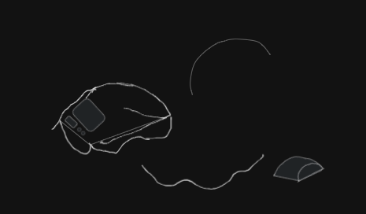

## May 31

It is my first hardware project. I have been thinking of trying out onboard since I joined hackclub, but I never got a chance.
I think this highways is my best shot. I am currently planning and synthesizing stuff. I wanted something original that's why I didn't start with the starter project.
I am currently vetting my plans. I have a solid Idea already thanks to my buddy that knows a lot about hardware :)
I will be frank I have an AI partner that helps me in brainstorming. My journal is original, and this is just the beginning. 

[No Image today ;0]

spend 2hrs

## June 01

I am done with my plans, but I gotta still research parts that are needed. 
I was confused at first thinking we need to make the full project before submitting. I have to check the highway guidelines once more
and I think I just have to design and make BOM. I set up the MicroPico extension on vs code and switch stubs to ES32. 
I will be using python instead of C++ until. I will switch when I am more comfortable with my shitty skills in C++. I suck at it.
I faced some errors initially and I find out it's fine since the hardware ai't connected. 

I started coding some firmware offline for now. I made pomodoro logic and idk if i's gonna work that well but I made it just in case.

A sneak peak hehe
I will check if my plan needs change but for now see ya tmr

spend 3hrs

## June 02

I started today with a block diagram of how I will connect my stuffs. I started sketching on my journal
I then remember excalidraw and I immediately discard my journal to use it. I did some research initially, 
and thanks to AI for clarifying things. I spent an hour and half making the block diagram. I ensure it's readable
I spent extra 10 mins taking out useless aesthetics I add like colors. 

I love this block diagram. it is pretty ngl. it wasn't easy stopping at this hehe
After I tested my shitty code and as expected a bit buggy. I ran some test and confirm some issues with my logic and I made some fixes.
I spent 2 hrs debugging as I added like 20 print statement just to get the exact error location. I did spent extra time cleaning the 
print statement. I ran the last test and yay it's working from python's end :|
Now I make the main orchestrator which is the main_controller.py
it was easier to implement as mostly it is place holders and part of pomodoro logic. 
I am cworking in parallel cuz I just made my BOM template on google doc. I cover some part as it was just rough hehe

spent 5hr 20mins

## June 03

I did a lot of coding today as I spent time making some of the firmware. I made a handler for TCRT5000 Sensor Module tho no hardware integration yet. I spent sometime research how to work with the sensor to detect presence. I made a generic presence class.
I improved pomodoro logic just added short break to the class. I made handler for the WS2812B RGB LED, SSD1306 OLED Display Module, and TTP223 Capacitive Touch Sensor Module just like tcrt5000 no hardware connection just a class ready to work with them. I had to do a lil bit of research just to make sure things work. it didn't work straight away lol. I faced some bugs that are stupidly easy but hard to find. I ran several test and some still failed so I am stopping here for today. I put them together in the main controller, and I added lots of print statement just for debugging. 

I am also gathering datasheet for my componenets to understand some stuffs about them. I think this is where everything will get hot. i gotta read them still. Not all but part of it. I will journal anything I find interesting here.

spent 4hr 12mins

## June 04

I went through the datasheets, and I was hit by technical details I know nothing about. I spent time on youtube and other tools that could help me understand those sheets. It was frustrating because I don't even know where to start at first, so I started anyways exploring the diagrams first. wihout yapping too much lemme jot some key stuffs I found useful to my project.

#### ESP32-DevKitC V4 (with ESP32-WROOM-32)

It will be the power sources of most of the components. Some utilizes 3.3V output (for OLED, TCRT5000, TTP223) and some 5V output (from USB, for WS2812B). The logic level is 3.3V. I figure out the tentative pin assignments for StudyStreak, here are they;
- OLED SDA - GPI021
- OLED SCL - GPI022
- WS2812B Data - GPI04 (Idk just the one I like)
- TCRT5000 Analog Out - GPI034 (ADC1-CH6, input-only)
- TTP223 Outpu - GPI013 (not concluded)
I find out i gotta avoid some pins as they are used for flash memory like GPIOs 6, 7, 8, 9, 10, 11 etc
Some buttons I saw in the sheet are EN(Reset), Boot (Download mode)

The diagram is colorful and cool

#### 0.96" I2C OLED Display

The module have a SSD1306 Controller with 128x64 pixels (my mobile is 3200x1440 😭😭) anyways i'm not making a phone. It uses I2C Interface which is suitable and as provided above I will be sticking to 3.3V for operating voltage (it supports up to 5V). for the pinout I'll do
- VCC (connect to ESP32 3.3V)
- GND (connect to ESP32 GND)
- SCL (connect to ESP32 I2C SCL pin like GIO22)
- SDA (connect to ESP32 I2C SDA pin like GPIO21)
I want to use 0x3C for the I2C Address since it's 7-bit address tho some libraries, according to a certain source, might refer to 0x78 if they mean the 8 bit address idk I still didn't get it.

The diagram here is kinda b&W

#### TTP223 Capacitive Touch Sensor Module

My fav module. It was the easiest to grasp since it's a touch sensor it makes sense. The operating voltage ranges from 2.0V to 5.5V, but i'll use 3.3V to stay on a safe point. for the pinout we'll do 3 lol
- VCC (connect to ESP32 3.3V)
- GND (connect to ESP32 GND)
- OUT (signal - connect to a digital GPIO on ESP32 like GPIO13)
I am still trying to understand the output behaivior but seems I will go with the common one. Active HIGH means OUT pin goes HIGH when touched, LOW otherwise. Momentary means OUT pin is HIGH only while touched. Here is the schematic diagram 

ughh my neck hurts damn

#### WS2812B Addressable RGB LED

uhmm this doesn't support 3.3V operating voltage at all so we are using 5V instead tho it ranges 3.5V to 5.3V. It works with data input logic level which requires VIH of at least 0.7*VDD. if VDD=5V, VH_min = 3.5V. we'll use the following pinout
- VDD (power - connect to ESP32 5V)
- VSS (ground - connect to ESP32 GND)
- DIN (data input - connect to ESP32 GPIO like GPIO4)
- DOUT (data output - not used for a single LED)
I will use a single data line for control which is specific timing protocol (handled by neopixel library). The data format is 24 bits per LED, GRB color order.

#### TCRT5000 Reflective Optical Sensor

This is also my fav module. It senses reflected IR or Infrared light as a means to detect something. the likely pinout I will consider
- VCC (connect to ESP32 3.3V)
- GND (connect to ESP32 GND)
- AO (Analog Output - connect to an ESP32 ADC pin like GPIO34)
- DO (Digital Output - will be optional, it may not use if AO is available and preferred)
The operating voltage I'll use is 3.3v even tho it ranges from 3.3V to 5V. The output behavior esp AO which I assume common pull up config on module. So, the voltage decreases with increased reflection or presence of an object. If no object = AO voltage is HIGH, near VCC. if Object present = AO voltage is LOW. Tho the sensitivity and specific voltage range will kinda need calibration with the actual hardware

phew a marathon today.

spent 7hrs (estimated)

## June 05

Uhmmm I gotta sleep guys 

I updated my BOM after going through all the datasheet. I got some price range and I find out the best place to get everything is Aliexpress. Amazon too expensive and local sellers too are expensive. They also don't accept HCB; hence, I gotta stick to aliexpress. I didn't do much today. 

spent 1hr 23 mins

## June 07

Yesterday was a special holidays so I took the day off. I started today by exploring PCB schematics. Make no mistake I am new to this but I can get stuff really fast. I will be using EasyEDA for now. I exploed it (more of playing around with it). I went on youtube to check for videos on basics, but I ended up scrolling through reels until I forgot what brought me there and left. I went to get groceries then my chaotic mind remembered I was supposed to learn PCB basics on yt. Damn!!
I made some firmware updates which I find esier than going to Yt to learn pcb. I'll give it a shot tomorrow, hopefully

spent 2hr 52 mins

## June 08

I started using Easy EDA. It has this weird interface (not as weird as adobe illustrator). I know nothing about it, and I supposed to check tutorial. I wasn't wired to start with tutorial tbh. I just have to break somethings to get a tutorial. I mess around with the drawing tools and the wire tools. for some reasons some of this tools drawings dissappear when changed. It feels like figma and illustrator.

well enough with that. I started going through the documentation and it was boring enough I slept there. kidding didn't sleep just skipped. I searched some videos on youtube and save them for later. I promise to make my schematic today

spent 1hr 12 mins

## June 09 

I promised my self yesterday that i will be making my schematics today. I set off by going through a 41 mins video on using easy eda. I watched up to 23 mins and stopped (yup I barely finish a yt video). I feel itch to start something instead of just watching. I now understood tools and how to search for componenets. I went back to my jottings on from my data sheet and I went back to my datasheet. I did that because my jotting wasn't that useful. I started with the ESP32-DEVKITC which is the brain and connects to everything. I then get the remaing 4 components. I wasn't able to get the module for TTP223 and TCRT5000. I used a generic 3 pin headers and changed their label to my corresponding components adhering to the datasheet
oh it wasn't smooth. I hit a roadblock when finding the "right" module. I have to look closely at the datasheets and the web. I was running mad when I couldn't find the modules for TTP223 and TCRT5000. A web result I found mentioned I could use generic headers and stuff, lucky me. Anyways after everything, I made my first schematics and I am more than happy tbh

here take a look. it looks amazing to me.

spent 6hrs 2mins

## June 10

I continue working on the my schematics making some fixes and additions of resistors and capacitor.
I added a resistor of 330 ohms in between WS2812B DI and ESP32 IO4 to protect it from any unexpected voltage spikes from the ESP32. I learn this tip in the on reddit. I have no idea or plans to add them there. I added a capacitor to WS2812B LED to smooth any current spikes the LED will demand. I added 100uF. I find out the LED turns on and switch to a bright light, it draws a sudden spike in current which might make the ESP32 to reset. A friend (friend of a friend lol) told me to add 12C pull up resistors(OLED). I had to research it and finally added two resistors between SCL and 3.3V (with VCC) and sme with SDA. 
I did an ERC and alot of pins not connected tho I find out it was fine. 
here is the screenshot

see you tmr

spent 2hrs 3mins

## June 11

I started drafting or lemme say I was sketching. I sketched what I believe will be the the case of my project. I started with a research of how OLED are normally placed on a case and I find the angled one more sleek and stylish. So i took inspiration from them. I use excalidraw to sketch. At first, Idk wahat I was doing and I was making things that are strange. I couldn't use the pen tool. I had to check youtube for tips and tricks to use excali draw. It was powerful base on what I saw about it. I used it before but just basic stuffs. I saw a video on how to manipulate lines, and this is when everythin clicked (no breakthrough yet). I drew some slines and curve it with no real destination. I had to go to gemini and ask for help in brainstorming something original. It asked me to answer a few questions about how I imagine it to be. I should view it as if it was on my desk. I imagined a mouse tbh. I told it what I imagine so It says make it original. I feel it should look like a mouse tho smaller. 

this was my first sketch (not kidding) I was obsessed so I tried to make it better. I made something a bit worse but it gave me an idea. Add and substract
it is a figma thing. I wasn't good at figma, but at least I am not that bad at it's concept. I started experimenting with shapes. Excalidraw lacks the tool and lots of shape. it was limited. 

I remembered the library tool. I used it to get more shapes to use. I saw semi circles, curved lines and other shaped and that is where I made breakthrough. I channeled my shitty figma skilled, and it was rewarding hehe. enough of this yapping lemme share it.

here is everything together. Lemme share the views too.

Here it is. It is not perfect and I don't expect it to be. ty

light mode

spent 4hrs 

## June 12

I will confess
I forgot to make GND connections 😭😭. I thought I was done. I started working on the PCB. 
Man I was confused ngl. The pcb outline was initally small. my 70mm by 50mm was wrong. I chose rounded rectangle which successfully gave me headaches. I then change to rectangle by remaking the pcb. so it was a mess I was putting them in the outline but those connections made me think I was doing things wrong. I remember I have a deadline so I'll check youtube tomorrow to confirm if I m doing things right.

hehe, I made this.

spent 2hrs

## June 13

I finally found a youtube video on how to do. I quietly followed it step by step. I referred to my sketch to make sure I am putting things right.
The issue is my resistor is big like too big. see my day 13. I know resistors are small but wth is wrong with mine. I made small google search about it. I saw that it was related to footprint and I find out through a thread that using R0805 is more than enough. I then went to change it but that part is not editable like I was fused. I was learning a lot of info simultaneously eh?
I then play around for some minutes then I went back to my schematic design and check it again. aha! It was editable and I search for R0805 and finally saw it. I do it for my 3 resistors. It was so satisfying when I uopdate my pcb and findout it worked. now we have issue with the outline again. LUCKY for me I can make custom outline since the one I have is too big. I then draw stuff like diagonal around it. too much winning today ahahaha 

hey did I tell you how satisfying was it to see the 3d version? it feels good more than milkshakes (strawberry always the GOAT)
I will starve y'all the image of the 3d one until I am done with routing tomorrow.

spent 2hrs

## June 14 

Cousin birthday 

## June 15

I took yesterday off, it was my cousin's bday. I started with routing today. it was the first thing I thonk of. I well used the auto route. I don't have much time to waste anymore. I clicked auto route and voila it made it perfectly. I then move to copper pour. I set my Nets to GND and then made the outline for copper pour both for the top layer and bottom layer. I clicked rebuild and boom!! it worked
Nein!!!!!!!!!!!!!! don't  be silly, it didn't work and it's wasn't straight forward. Infact I fundamentally messed up. I was losing brain cells for nothing. it was GND like it wasn't connected to the Netflag GND. phew, I did it 
my copper pour now rebuilds and worked. remember it have to be always the schematics hehehe
I reposition labels and any generic stuffs not to obstruct the copperlines. I added labels for generic 3 point components I used for TCRT5000 and TTP223 so I did that to avoid confusion when putting things together. things have been straight forward so far.
I did add my labels and I will share screenshot now

it was sooooooooooooo satsfying and my obsession is maxed. 
Oh lemme share the 3d. I bet you will love the view lmao

here is the back for no reason

so I will be moving straight to CAD tomorrow. see ya

spent 4hrs approximately

## June 16, 17, 18, 19, 20, 21, 22, 23

I was away, I couldn't work on the project given a school project and test we were doing. I had to take time off for the sake of mental health. I am juggling a lot of stuffs and I had to drop some and focus on urgent and very important task. I do learn a bit about CAD. I want to bring my sketch to life. I downloaded fusion 360 for students. I got the license through my brother's college email lol.
I downloaded and install it. I followed each instruction and I was good to go. I mean I got other things to beep beep......

## June 24

Phew things have ease out but not over tho gotta finish my 3d model by June 30. I started the day by searching tutorial on youtube like any other noob to be nerd. I found couple of videos on youtube and tbh I see ones encouraging and discouraging learning CAD with fusion 360. Uhmmmm, I was kinda confused rn............kidding I wasn't as I already know what I want. I just look for most recent and most watched video on fusion 360 tutorial. I first watch everything then save it. I then look for others and save them for working with the next. I am chunking the process to accomodate other tasks. see ya

spent 1hr 23mins

## June 25

Today, was the day to start working with FUSION 360. I started with the most rounded tutorial. It was easy to follow and kinda verbose. 
We are gonna make a rack. A wooden rack to be precise. The cool thing about all this is the environment. The 3d environment is awesome. I failed to follow the tutorial at first. I go with my gut. I play around with the sketch thing and extrude thing. I break and make things. I would have shown you but unfortunately I couldn't save them 😭😭. My Autodesk wasn't fully setup or internet issues.Idk the issue. My windows crash :< *panic*
Oh it wasn't a crash. it was updating after so many months without update. I lost work sed. I just got this page and it staged like this for 2mins after the update. 

Oh, I forgot my tutorial lol. I will do it tomorrow. I gotta finish my assigment

spent 1hr 56 mins

