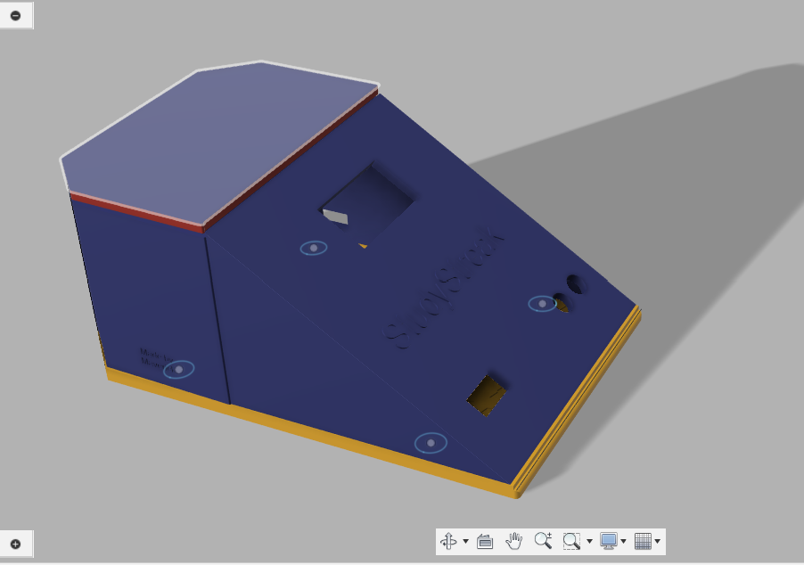
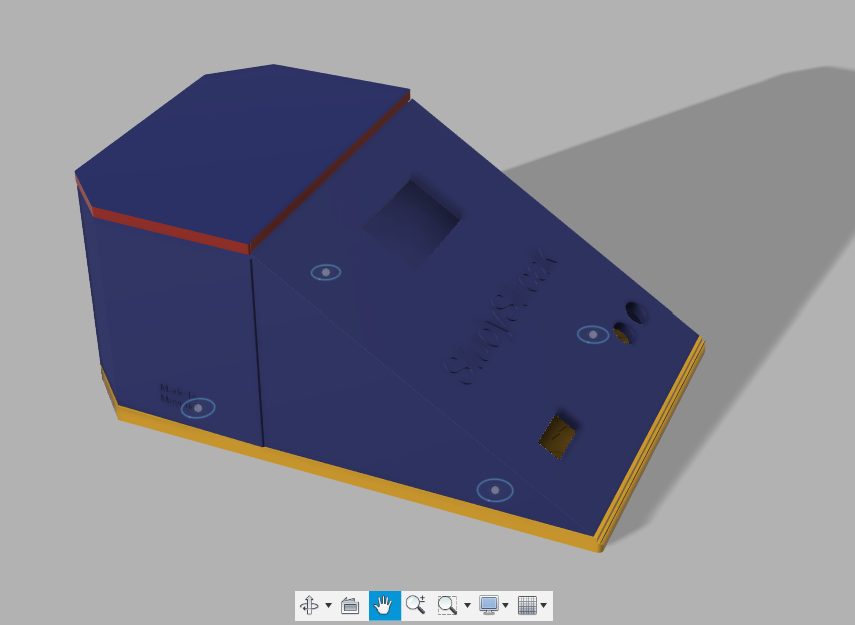
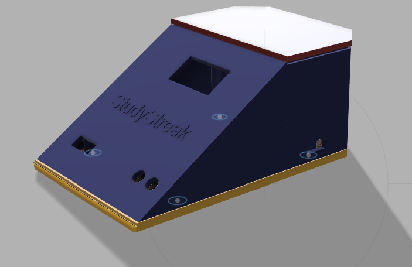
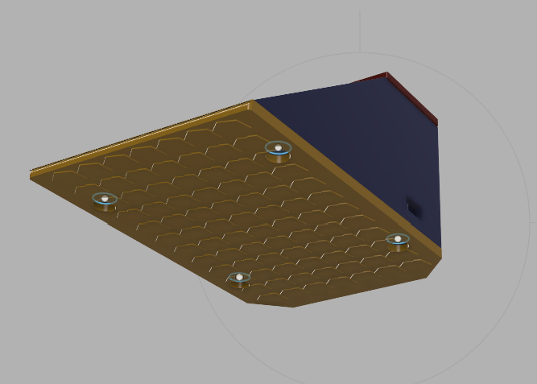
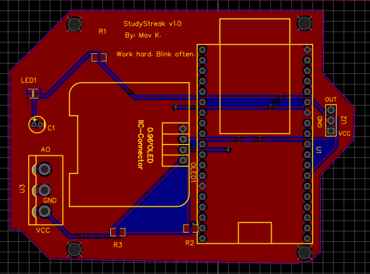
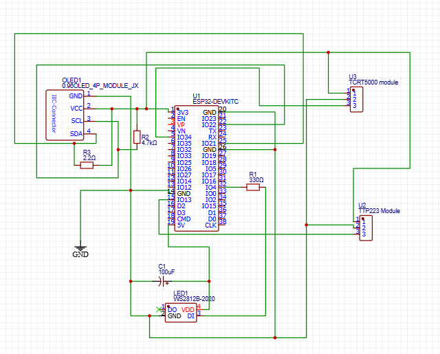

# StudyStreak

Study streak is a background desk device that is health-aware which is designed to promote a healthier study-break cycles for students mostly tho professionals can use it.

-----

### Description

StudyStreak is a desk device that kinda tracks your presence intelligently especially to manage Pomodoro-style focus sessions. Instead of alarms or on-screen notifications that can be annoying and intrusive, It make use of a soft, color-coded ambient lignt and eah there's an OLED display yo gently signal when it's time to study and when it's time to kinda take a break or walk.

### Why I Made This

As a student, I hate long hours study sessions. Sometimes it is necessary so I ended up burnout and strained due to to long, uninterrupted study sessions. So, I wanted to create a physical tool not replace alarm or another burden like wearable but a tool that could encourage heathier habits without kinda adding to the ditractions from phones and PC. So StudyStreak is my solution: a simple, dedicated device to help maintain focus and well-being during intense work periods.

-----

## Pictures of the Project

### 3D Model & Case Design

The enclosure is a multi-part, 3D-printable case designed from scratch in Fusion 360 for ergonomics, aesthetics, and ease of assembly.

*The complete CAD source files (`.f3d`, `.stl`) are located in the `/case` directory.*
*I have made the stand off for the PCB and OLED. They both have holes so I can screw through.*

### PCB Design & Wiring Diagram

All electronics are integrated onto a custom 2-layer PCB designed in EasyEDA. The schematic below serves as the wiring diagram for the project.

**PCB Layout:**

**Schematic:**

*The complete EasyEDA source file (`.json`) is located in the `/hardware` directory.*

-----

## Bill of Materials (BOM)

Here is a summary of the components required for this project, with prices including estimated shipping.

| Item No. | Part Name / Description | Qty | Estimated Total Price + shipping (USD) |
| :--- | :--- | :-- | :--- |
| 1 | ESP32 Development Board | 1 | $9.61 |
| 2 | OLED Display Module, 0.96 inch | 1 | $4.99 |
| 3 | TCRT5000 Reflective Optical Sensor Module | 1 | $3.14 |
| 4 | WS2812B Addressable RGB LEDs | 5 | $3.71 |
| 5 | TTP223 Capacitive Touch Sensor Module | 1 | $3.65 |
| 6 | Resistor Kit (330 Ohm) | 1 | $4.24 |
| 7 | Capacitor Kit, Elyt., 100uF (\>=10V) | 1 | $4.81 |
| 8 | Micro USB cable | 1 | $3.66 |
| 9 | Solderless Breadboard | 1 | $6.80 |
| 10 | Soldering Iron & Multimeter Repair Kit | 1 | $25.63 |
| | **GRAND TOTAL (ESTIMATE)** | | **$70.24** |

*check the `BOM.csv` file for complete BOM and links*
-----

